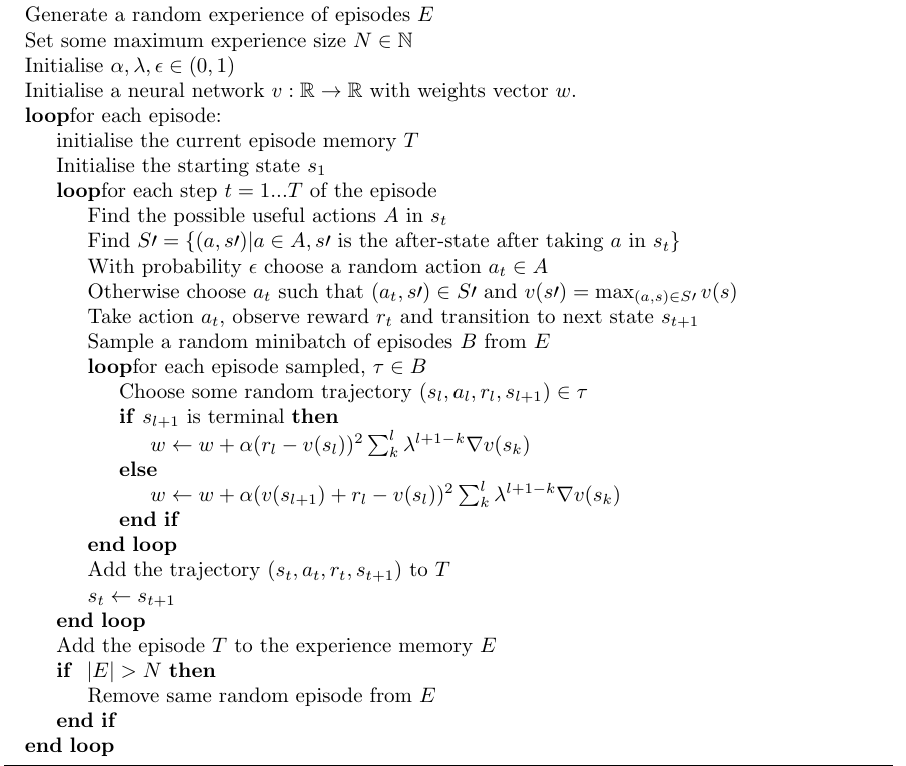

# Lambdemic
*Lambdemic* is a reinforcement learning agent being trained to play the board game *Pandemic*.

## Pandemic the board game
Pandemic is a cooperative board game for 2-4 players where
people work together to cure 4 diseases spreading across the world.
Detailed rules of the game can be found
[here](https://images-cdn.zmangames.com/us-east-1/filer_public/25/12/251252dd-1338-4f78-b90d-afe073c72363/zm7101_pandemic_rules.pdf)
and a how-to-play video can be found [here](https://www.shutupandsitdown.com/videos/how-play-pandemic-legacy/).

## Pandemic Environment
Included is an environment for Pandemic the board game that agents can act in. When building the environment you can
specify what disease colours to play with, for example just having blue and red diseases.

A basic random agent can be implemented as such:
```
from game_v2 import Game
import random as randint

env = Game()
action_shape = env.get_action_shape()
env.print_current_state()

done = False
while not done:
    action = rand.randint(0, action_shape - 1)
    next_state, reward, done, info = env.step(action, print_actions)
    env.print_current_state()
```

## TD-Lambda/Lambdemic Agent
The TD-Lambda agent can be trained and uses the following algorithm. The agent uses Tensoflow to build
its neural network.



Also included is trained neural network for specific Pandemic environments.

## Acknowledgments
Pandemic was designed by Matt Leecock who can be found [here](https://www.leacock.com/).
